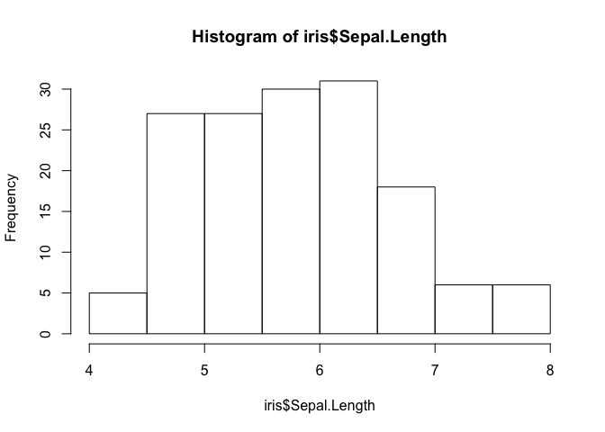

# Base `R` plotting
Chris Hamm  
`r format(Sys.Date())`  


## Introduction

Base `R` refers to the default suite of tools that come with a standard `R` installation. There are many packages that allow the user to plot in different ways. For example, the package `ggplot2` is particularly popular. However, these alternative packages require learning a new language (the **gg** in `ggplot2` stands for **g**rammer of **g**raphics) and you may not feel inclined to learn another language. Whether you prefer `ggplot2` or base `R` is besides the point. If you are making reproducible figures in `R` you are already winning. For the record, I use both base `R` and `ggplot2`. Both have their own strengths and weaknesses.

We will be working with the`iris` data set, which comes with `R` when you install the software. 

### `iris` data set 

The history of the [`iris` flower dataset](https://en.wikipedia.org/wiki/Iris_flower_data_set) is very interesting. In short, the data were collected by E. Anderson and introduced by one of the founders of statistics, R.A. Fisher, in the [paper](http://onlinelibrary.wiley.com/doi/10.1111/j.1469-1809.1936.tb02137.x/abstract;jsessionid=872BB90F822BC6CED8F4696E544EF6F5.f03t04) that described [`linear discriminant analysis`](https://en.wikipedia.org/wiki/Linear_discriminant_analysis). But enough about that, let's load the data and generate some plots. 

To load the `iris` data set:

```r
data(iris)
```

Nothing appears to have happened but in fact we did load the data set into `R`'s memory. Let's look at the dimensions of the data set and the first 6 rows of data:


```r
dim(iris)
```

```
## [1] 150   5
```

```r
head(iris)
```

```
##   Sepal.Length Sepal.Width Petal.Length Petal.Width Species
## 1          5.1         3.5          1.4         0.2  setosa
## 2          4.9         3.0          1.4         0.2  setosa
## 3          4.7         3.2          1.3         0.2  setosa
## 4          4.6         3.1          1.5         0.2  setosa
## 5          5.0         3.6          1.4         0.2  setosa
## 6          5.4         3.9          1.7         0.4  setosa
```

We can see there are 150 rows and 5 columns of data. Those 5 columns are: 

1. `Sepal.Length`
1. `Sepal.Width`
1. `Petal.Length`
1. `Petal.Width`
1. `Species`

It looks like the first four columns of data should be continuous numbers and the last column should be a factor. Let's make sure that `R` is treating the data accordingly:


```r
str(iris)
```

```
## 'data.frame':	150 obs. of  5 variables:
##  $ Sepal.Length: num  5.1 4.9 4.7 4.6 5 5.4 4.6 5 4.4 4.9 ...
##  $ Sepal.Width : num  3.5 3 3.2 3.1 3.6 3.9 3.4 3.4 2.9 3.1 ...
##  $ Petal.Length: num  1.4 1.4 1.3 1.5 1.4 1.7 1.4 1.5 1.4 1.5 ...
##  $ Petal.Width : num  0.2 0.2 0.2 0.2 0.2 0.4 0.3 0.2 0.2 0.1 ...
##  $ Species     : Factor w/ 3 levels "setosa","versicolor",..: 1 1 1 1 1 1 1 1 1 1 ...
```

We are good to go. Let's make some plots.

## Plots

### Histogram

The basic command to create a histogram is `hist()`. We need to specify which of the columns we want to plot in our histogram. Let's plot a histogram of `Sepal.Length`.


```r
hist(iris$Sepal.Length)
```



Yay!

Wait. This is kind of boring to me. 

The real power of plotting in `R` comes from the ability to customize graphics. We plotted with the default parameters for the `hist()` function.

To see the default parameters of a function, and all of the other arguments that can be passed through a function, we use the `?` in front of the function name.


```r
?hist
```

This will open the `Help` window on your computer and show you the arguments and defaults for a function. 
